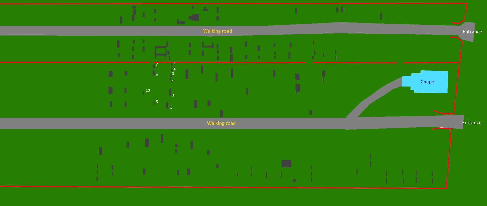
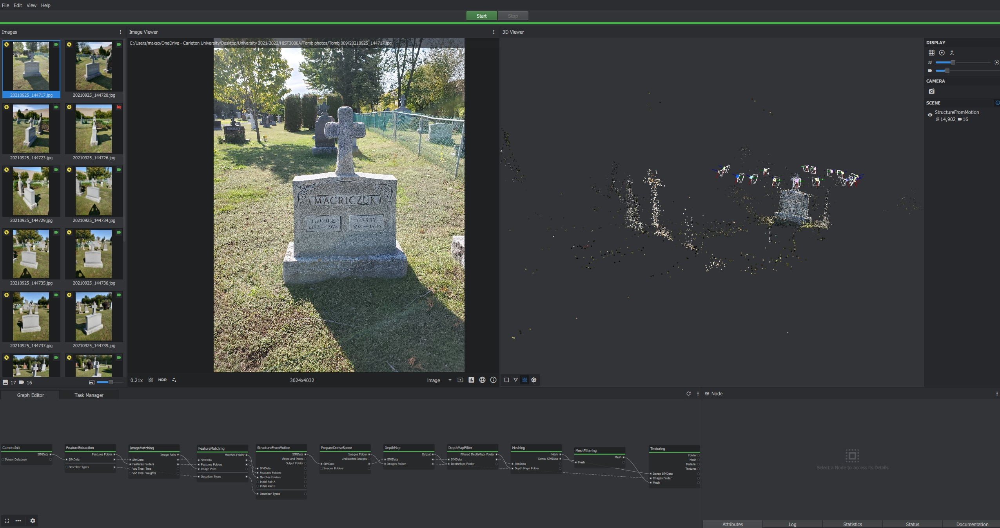
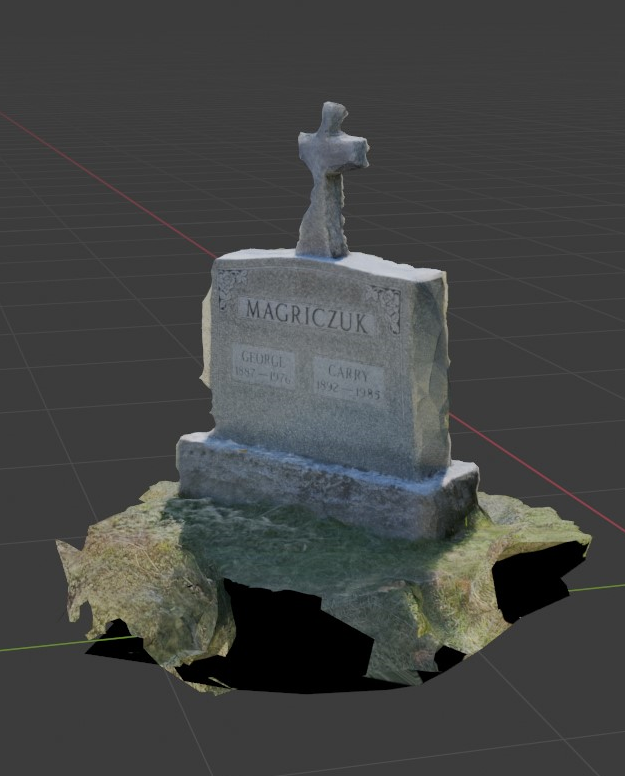

# The Graveyard project

For the class of HIST3000, we were promtped to investigate and record a cemetery in our community. The information here will concerns the Holy Trinity Bukovyan Chapel and Cemetery in Ottawa. 

## The preparation of the project

Before visiting the site, we were tasked and advised to create a quick sketch map of the graveyard using Google Earth and any basic drawing software like paint.
This would allow us to easily navigate the cemetery, and choose which graves to explore.

## The recording

Visiting the cemetery was both an educational and eye-opening experience. Since we were tasked to record the tomb's information digitally (quote, style, shape, inscription, measurements...etc), a lot of ethical dimensions surfaced. Each tombs information would go in the web into the class' larger database which contains every student's project for the cemetery. 

It was also relevant to the project to take pictures of the graves and record them digitally. That is to say, to create 3D models of them! Effectively preserving the people in question forever in a digital database. 

Using the pictures and [Meshroom](https://alicevision.org/) application, the many photos would first create a point-based shape and then would be refined into a greater detailed mesh. The results are stunning!

## Ethical dimensions

This project involves and presents many ethical problems and questions we have to think about. What does it mean to digitalize the information here, without the explicit consent of the deceased person (not that we can since they are no longer alive)? We could argue that we are reducing a living thing, memory, and legacy to a small digital box. These questions are amongst many that was explored in class.
